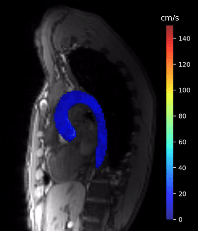
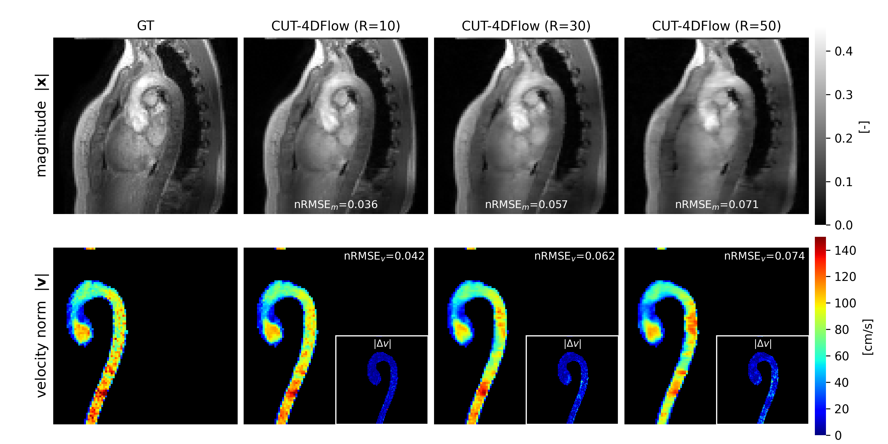

# ℂUT-4DFlow

Reference implementation for the paper **"ℂUT-4DFlow for Accelerated 4D-Flow MRI Reconstruction."**

<p align="center">
  
</p>

## Abstract

We propose ℂUT-4DFlow, a complex-valued, unrolled transformer for accelerated 4D-flow MRI
reconstruction. It extends FlowMRI-Net by replacing its complex-valued sequential
convolutional-recurrent layers with complex transformer layers, whose attention is
parallelizable. We further augment the FlowMRI-Net loss with a term acting on the
velocity-encoding differences in k-space, making it more sensitive to velocity. The network
is also set up as a unified pipeline that can be trained in either supervised or
self-supervised mode, depending on data availability. Because the objective is defined in
k-space rather than in the image domain, it is not tied to a specific anatomy, which can aid
generalization. We evaluate ℂUT-4DFlow on aortic reconstruction and assess its generalization
across clinical sites, diseases, and anatomies.

## Results



**Fig. 3.** Magnitude (top) and velocity norm (bottom) for a selected aortic case
(Center 012, Philips Ingenia 3T, subject P005). Magnitude and velocity norm total errors are
shown as nRMSE and error maps for the velocity norm are reported as inserts.

## Models

The three configurations reported in the paper, with their trained weights:

| Model | Config | Checkpoint | Unrolled units *N* | *d* | Heads | Real DOF |
|---|---|---|---|---|---|---|
| Base | `configs/base.yaml` | `checkpoints/full_sup_base` | 10 | 128 | 8 | 1.34 M |
| Ablations | `configs/ablation.yaml` | `checkpoints/full_super_v2` | 10 | 96 | 6 | 0.76 M |
| Final | `configs/train.yaml` | `checkpoints/full_super_v3_d160_n15` | 15 | 160 | 10 | 13.65 M |

The Final model unties the CLN → CMLP block across units and is trained with an exponential
moving average of the weights; the shipped checkpoint stores those EMA weights, which are the
ones used for all reported results. Checkpoints contain weights and the training config only
(no optimiser state).

## Installation

```bash
conda env create -f environment.yml
conda activate cut4dflow
```

## Data

The CMRxRecon 4D-flow dataset is available at
https://www.synapse.org/Synapse:syn64545434/wiki/630587 .
Download it and extract under `Data/` (see [`Data/README.md`](Data/README.md) for the
expected layout).

## Training

```bash
./scripts/train.sh configs/train.yaml
```

Edit the config for architecture and optimisation settings, or override the data root with
`CMRX_TRAIN_ROOT`. Checkpoints are written to `checkpoints/`.

## Reconstruction

```bash
CKPT=checkpoints/full_super_v3_d160_n15/best.ckpt ./scripts/recon.sh
```

This reconstructs a ValidationSet and writes the submission layout (sparse `.npz`) plus
optional per-case animations (`ANIM=1`). The model architecture is read from the checkpoint.

## Repository layout

```
src/
├── models/       complex layers, attention, denoiser, DC/WA, cascade, conditioning
├── data/         dataset, kt-Gaussian sampling, SSDU split, orientation, HDF5 reader
├── training/     training loop and losses
├── recon/        full-cycle reconstruction utilities
├── postprocess/  submission writer and animations
├── utils/        FFT ops and evaluation metrics
└── baselines/    CG-SENSE and compressed-sensing (locally low-rank) baselines
configs/          training configurations (base / ablation / final)
scripts/          conda entry points (train / recon)
Data/             dataset (downloaded separately)
checkpoints/      trained weights
```

## Acknowledgements

This work was supervised by:

- [Luigi Perotti](https://github.com/luigiemp)
- [Kevin Moulin](https://github.com/KMoulin)
- [Dennis Ogiermann](https://github.com/termi-official)
